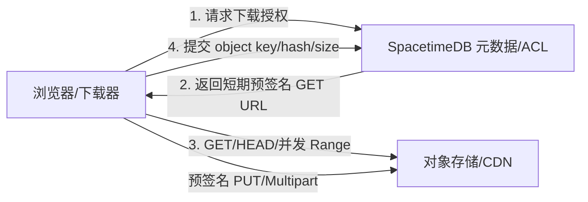

# SpacetimeDB 文件存储与现代下载架构分析

## 结论

**将大文件按二进制切片永久存进 SpacetimeDB，不是“可下载直链 + 大文件并发下载 + 断点续传”目标下的最佳生产方案。**

推荐边界：

- **SpacetimeDB**：文件元数据、所有者/ACL、上传状态、对象 key、大小、MIME、内容哈希、版本、审计状态。
- **S3 兼容对象存储（S3/R2/MinIO 等）+ CDN**：文件字节、流式传输、HTTP Range、缓存、带宽扩展、预签名 GET/PUT。
- **浏览器/下载器**：使用一个普通 HTTPS URL 下载；下载器按需发多个 Range 请求，实现并发与续传。

SpacetimeDB 二进制列适合需要和业务数据一起参与事务或订阅的**小型 blob**。官方把文件存储描述为直接写入表的二进制列；同时官方说明表数据常驻内存并持久化到磁盘。因此，大文件字节会占用数据库内存，并进入数据库事务、持久化和复制/订阅模型，这和对象存储的数据面职责不匹配。[SpacetimeDB File Storage](https://spacetimedb.com/docs/tables/file-storage)；[SpacetimeDB Tables](https://spacetimedb.com/docs/tables)

## 两个必须拆开的“内存问题”

### 1. 浏览器前端内存

当前仓库已经不需要先在前端把所有分片拼成 `Blob` 再触发下载：

- `client/src/config.ts` 生成 `/route/download?id=...` 直链。
- `client/src/App.tsx` 直接把该 URL 放进 `<a href>`。
- `server/src/index.ts` 的下载端点声明 GET、HEAD、Range、ETag/If-Range、206、416 和 `Content-Disposition`。

因此，从**代码审查**看，打开链接即可进入浏览器原生下载路径，文件不需要完整驻留前端 JavaScript 堆。这里未对线上端点执行 HEAD/Range/416 实测，所以这是代码能力判断，不是运行验证。

### 2. SpacetimeDB 服务端内存

当前端点仍不是流式下载：

- `server/src/download.ts` 的 `assembleByteRange` 为整个请求区间分配一个连续 `Uint8Array`。
- `server/src/index.ts` 在 `ctx.withTx` 内读取分片、缓存分片、拼成完整响应 `body`，然后构造 `SyncResponse`。
- 完整 GET 会把整文件组装为一个响应体；Range GET 也会先把该 Range 完整组装到内存。

所以：**HTTP Range 支持不等于服务端流式响应。** 分片表只让单次较小 Range 请求少读取一些数据；它不会让完整 GET 自动变成边读边发。

## 当前方案已经具备什么

从代码审查看，当前下载协议基础已经覆盖：

| 能力 | 当前实现 | 说明 |
|---|---:|---|
| 可复制、可直接打开的 URL | 是 | `/v1/database/{module}/route/download?id={id}` |
| 浏览器原生保存 | 是 | `Content-Disposition: attachment` |
| 文件大小探测 | 是 | HEAD + `Content-Length` |
| 单区间 Range | 是 | `Range: bytes=start-end` → 206 |
| 断点续传协议基础 | 是 | `Accept-Ranges`、`Content-Range`、ETag、If-Range |
| 多区间单请求 | 否 | 当前明确拒绝 `bytes=0-1,4-5`；并发下载器通常也可用多个单区间请求替代 |
| 服务端流式输出 | 否 | 每个响应区间先组成连续内存 body；应用层不限制文件体积 |
| 浏览器保证自动多线程 | 否 | 响应头只允许 Range；是否并发由浏览器/下载器决定 |
| 私有下载/签名链接 | 否 | 产品选择公开读；二进制表私有，字节只能经 HTTP 端点读取 |

RFC 9110 定义了 `Range`、`Accept-Ranges`、`Content-Range`、`If-Range`、206 和 416；这些是标准下载器执行续传与多连接区间下载的协议基础。[RFC 9110 §13–15](https://www.rfc-editor.org/rfc/rfc9110.html#name-range-requests)

但普通浏览器点击链接通常只是一个原生下载，不应承诺“一定多线程”。多线程是客户端策略：IDM、aria2、浏览器下载管理器或自定义客户端可以对同一 URL 并行请求互不重叠的区间。AWS 官方也明确建议通过多个并发 Range 请求提高聚合吞吐，并缩短中断后的重试范围。[Amazon S3 Performance Guidelines](https://docs.aws.amazon.com/AmazonS3/latest/userguide/optimizing-performance-guidelines.html#optimizing-performance-guidelines-get-range)

## 为什么数据库切片不是最佳大文件数据面

### 常驻内存和持久化放大

SpacetimeDB 官方说明所有表数据存放在内存中，并自动持久化到磁盘；commitlog 会记录已提交事务以保证持久化。把大文件拆成行不会改变“文件总字节进入数据库内存与持久化路径”这个事实，只改变行粒度。[Tables](https://spacetimedb.com/docs/tables)；[Commitlog](https://spacetimedb.com/docs/reference/internals/commitlog)

### 请求路径发生额外复制

当前分片下载路径至少包含：查询分片、把列内容包装成 `Uint8Array`、Map 缓存、再复制到最终连续 body。完整下载还在一个数据库事务内执行这些工作。并发 Range 越多，数据库并发事务、读取和内存复制越多。

### 分片行已经退出客户端订阅数据面

SpacetimeDB 订阅会先发送匹配行，并持续推送更新。[Subscriptions](https://spacetimedb.com/docs/clients/subscriptions) 当前实现已把 `file_blob`、`file_chunk` 和 `upload_session` 改为 private，仅 `stored_file` 元数据公开。生成的客户端绑定不再暴露二进制表，客户端不能绕过 HTTP 下载端点直接订阅文件字节。

### 缺少成熟对象传输能力

SpacetimeDB 官方 HTTP handler 支持暴露 HTTP API，但当前公开资料没有给出流式 response body、零拷贝文件发送、对象存储式 Range 优化或 CDN 缓存语义。因此不能假设 `SyncResponse` 是大文件流式接口。[HTTP Handlers](https://spacetimedb.com/docs/functions/http-handlers)

## 当前权限语义

项目选择“公开读、所有者写”：

- `stored_file` 公开，所有连接者都能查看元数据。
- 下载端点公开，所有人可通过文件 id 下载。
- `file_blob`、`file_chunk`、`upload_session` 为 private，客户端无法直接读取字节或上传会话。
- 文件和上传会话记录 `owner_identity`；继续上传、完成、取消和删除均校验 `ctx.sender`。
- 浏览器持久化匿名身份令牌，以便刷新后仍保有已上传文件的写权限。
- 应用层不设置文件体积上限；完整 GET 的峰值内存会随文件大小增长。

这修复了任意调用者删除文件和直接订阅二进制表的问题，但公开下载是明确的产品选择，不是私有下载或签名 URL。

## 三种方案比较

| 方案 | 适用范围 | 直链/Range | 服务端内存 | 运维与扩展 | 判断 |
|---|---|---|---|---|---|
| 整文件一个 `byteArray` | 小文件、强事务 blob | 可由自建 handler 模拟 | 完整响应通常较高 | 简单但数据库内存成本高 | 仅小文件 |
| SpacetimeDB chunk 表 | 原型、受限文件规模 | 可映射单 Range | 单 Range 有界；完整 GET 仍整文件 | 分片、事务、清理、复制复杂 | 过渡方案，不是最佳生产数据面 |
| 对象存储 + SpacetimeDB 元数据 | 大文件、公开/私有下载 | 原生 GET/HEAD/Range/ETag | 应用层无需整文件缓冲 | CDN、容量、吞吐和并发成熟 | 推荐 |

## 推荐落地架构

推荐元数据至少包含：

- `file_id`
- `owner_identity`
- `object_key`（不可直接信任用户输入）
- `file_name`
- `content_type`
- `size_bytes`
- `content_hash` 或对象版本/ETag
- `state`：uploading / ready / deleted
- `created_at`

下载流程：

1. 客户端用文件 id 请求下载授权。
2. SpacetimeDB 验证 owner/ACL。
3. 返回 1–15 分钟有效的预签名 GET URL，或 302/307 到该 URL。
4. 浏览器直接打开即可下载；下载管理器可发 HEAD 和多个 Range 请求。
5. 对象存储/CDN负责 `Content-Length`、`Accept-Ranges`、206、`Content-Range`、稳定 ETag 和流式传输。

S3 和 R2 都提供可直接放入浏览器的预签名 URL；预签名 URL 是到期前有效的 bearer token，泄漏者在有效期内拥有对应操作权限，因此应短期、限定单对象和单方法。[AWS Presigned URLs](https://docs.aws.amazon.com/AmazonS3/latest/userguide/ShareObjectPreSignedURL.html)；[Cloudflare R2 Presigned URLs](https://developers.cloudflare.com/r2/api/s3/presigned-urls/)

## 若暂时继续用 SpacetimeDB 分片

把它明确限制为过渡方案：

- 设置严格文件大小、单 Range 大小、并发数和配额上限。
- 保留 HEAD、单 Range、206、416、强 ETag、If-Range。
- 下载 URL 使用不可枚举授权标识；同时把 blob/chunk 表改私有。
- owner/ACL 进入元数据，所有写 reducer 校验调用者。
- 不承诺完整 GET 流式，也不承诺浏览器自动多线程。
- 压测峰值内存、事务时间、并发 Range、数据库恢复与备份体积。
- 达到规模阈值后迁移字节到对象存储，而不是继续在同步 handler 增加分支。

## 最终判断

- **小型、需要事务/实时订阅的 blob**：SpacetimeDB `byteArray` 合理。
- **现代云盘的大文件数据面**：对象存储/CDN 是正确边界。
- **当前仓库**：直链、标准单 Range、私有二进制表和 owner 绑定已经存在；前端无需整文件 Blob，也不限制文件体积。仍受限于服务端非流式缓冲、数据库常驻内存/复制成本和没有 CDN，超大文件完整下载具有明确内存风险。
